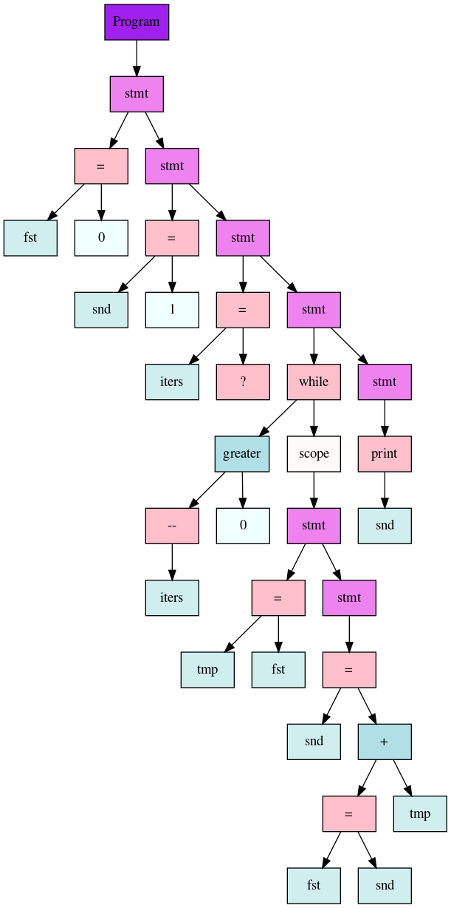

# ParaCL 

> **Интерпретатор языка Парасил** считывает со стандартного ввода всё, что считывается, и печатает на стандартный вывод всё, что нужно распечатать

 **Парасил** - простой СИ-подобный язык.
  
 ### Пример программ на парасиле
 ##### (если вводится в терминале, то чтобы завершить ввод, нужно
 ##### отправить Ctrl + C, Enter)
 

  ```
  fst = 0;
  snd = 1;
  iters = ?;

  while (iters-- > 0)
  {
    tmp = fst;
    snd = (fst = snd) + tmp;
  }

  print snd;

  ```

  ```
  y = 1;

  while (((x = ?)++)++ > y > 0)
  {
    print /*комментарий*/ y = x;
  }

  ```

 ### Синтаксис:

  1. ###### Все типы **int**

  2. ###### Программа состоит из *утверждений*:


  * Условный оператор **if**
  ```
  if(expression) 
  {
    ....
  }
  else
  {
    .... // либо сокращенная форма без {}
  }
  ```


  * Цикл **while**
  ```
  while(expression)
  {
    .... //  либо без  {}
  }
  ```


  * **Присваивание** арифметического выражения либо ввод с клавиатуры
  ```
  x = 1; // возвращают новое значение x
  x = ?; 
  ```


  * Постфиксные **инкремент** и **декремент**
  ```
  x++;  x--;   // возвращают новое значение x 
  ```


  * **Вывод** на экран
  ```
  print x; 
  ```


  3. ###### Комментарии
  ```
  // Однострочные   и 

  /*         много
     строчные      */
  ```


  4. ###### Приоритет операций
  ```
  1. ++, --
  2. -      // унарный
  3. * , /
  4. + , -
  5. > , <, >=, <=, ==, !=
  ```

-----------------------------------------------------------------------------

 ### Функции и области видимости в ParaCL


  1. ##### Области видимости

* Время жизни объекта ограничено его областью видимости
  ```
  {
    y = 1;
  }

  print y;
  ^C

  Uninitialized variable in current scope
  4 | print y ; 
    |        ^
    | Error in row number 4 and column number 2


  ```


* **Scopes** возвращают результат последнего expression внутри
  ```
  x = {
    y = 18;
    z = { print y; }
    y + z--;
  }; //  ; не обязательна

  print x; //x == 35
  ```


  2. ##### Функции также являются объектом

* Для введения функции:  **func**, имена аргументов, scope

Внутри функции можно обращаться только к переменным, объявленным как аргументы функции либо к локальным.

  ```
  summ = func(x, y)
  {
    x + y;
  }; // ; не  обязательна

  z = summ(1, 2); // z == 3
  ```


* Результат функции - результат последнего expression, либо явный **return**
  ```
  negate = func(x)
  {
    if (x < 0)
      return x;

    return -x;
  }

  y = 10;
  z = negate(y); // z == -10
  ```


* Возможно имя, например, для рекурсии, которое видно из любого scope
  ```
  fibbonachi = func(x) : fibb
  {
    res = 1;
    if (x > 1)
      res = fibb(x - 1) + fibb(x - 2);
    res;
  }

  x = fibbonachi(10); // x == 89
  ```


 
-----------------------------------------------------------------------------

 ### Сборка всего проекта:  
 
 * В главной директории
```
  $cmake .
  $make
```
 * Чтобы удалить объектные файлы со всего проекта:  
```
  $make clean
```

 * Чтобы запустить *интерпретатор языка ParaCL* нужно в главной директории (при таком запуске программа будет считана со стандартного ввода до сигнала Ctrl + C, Enter):
``` 
  $./Interpreter   
``` 

 * Можно указать название файла с программой на языке ParaCL (например, если Program.txt в текущей директории) в агрументах командной строки:
```
 $./Interpreter  Program.txt
```

 * (это пока что не работает) Чтобы посмотреть на построенное *синтаксическое дерево* нужно в директории **ParaCL**:
 ```
 $dot sintax_tree.txt -Tpng -o sintax_tree.png
 $shotwell sintax_tree.png

 ```

  


 * Чтобы запустить *тестирование языка ParaCL* нужно в директории **Tests** (будут запущены тесты на парасил из директории "tests/data" и на обработку ошибок из "input_tests/data", результаты будут на экране):  
```  
  $./ParaCL_test

```

